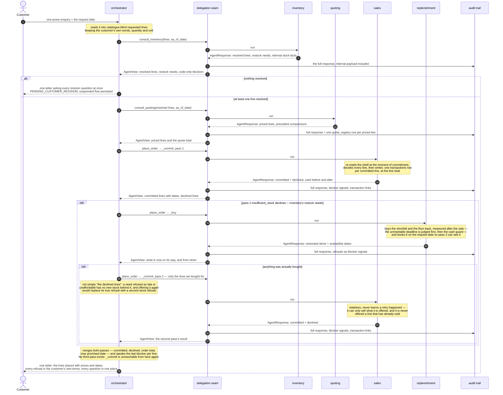

# The workflow diagram

The Beaver's Choice multi-agent system as built: five agents, every tool each
one owns, the starter helper each tool wraps, and the order the orchestrator
drives them in.

It describes the code in `project/beaver/`, not the design document that
preceded it. Where the two diverged, this diagram follows the code and the
divergences are listed at the end. This diagram is not maintained by hand. A test parses the
first two blocks below and fails if a tool drawn here does not exist, if a tool
the models can call is missing, if a model-callable tool is drawn as though it
were not, or if one of the seven required helpers is not visibly wrapped — so
the drawing cannot quietly drift away from the system. That test is kept in the
repository's history rather than in this submission; the diagram below is the
version it last passed against.

For the shape alone — five agents and the flows between them —
[`workflow-high-level.md`](workflow-high-level.md) draws the same system without
the tools.

## The architecture

Read it in three bands. The **orchestrator** owns the plan and every
customer-facing word; the **four domain agents** each own one question and
answer nothing else; the **systems of record** are written only through a
provided helper, and read directly only where no helper exposes the column.

A tool box reads: the function's name, what it is for, and the starter helper it
wraps — or `no starter helper` where the rule is ours rather than the starter's.
Three border styles:

- **solid** — a tool the agent's model may call.
- **dashed** — **not offered to the model.** Its arguments are money or exact
  names, and it is called by the agent's output function with what the
  arithmetic produced, so a row the books depend on can never go unwritten
  because a model forgot to ask for it.
- **thick** — model-callable *and* called again by the output function. The
  model's call is what the audit trail records; the output function's call,
  taken in the same breath as the writes, is what the money moves on. They are
  the same function rather than a tool and a shadow of it, so the reading the
  trail shows and the reading the business acted on cannot drift apart.

```mermaid
flowchart TB
    CUSTOMER["Customer request<br/>one prose enquiry + the date it arrived"]
    REPLY["One customer-facing reply<br/>outcome + letter + resume token"]

    subgraph ORCHESTRATOR["ORCHESTRATOR — plans, routes, writes the letter. Never acts on a system of record."]
        handle_request["handle_request — the request's whole life<br/>runs the agent, derives the outcome from the journal,<br/>persists a suspended flow, records the cash delta"]
        orchestrator_agent["orchestrator_agent<br/>reads the enquiry into catalogue-blind requested lines,<br/>drives the sequence, writes every customer-facing word"]
        consult_inventory["consult_inventory — delegation<br/>what do we sell of this, and how short are we?"]
        consult_quoting["consult_quoting — delegation<br/>what does each resolved line cost?"]
        place_order["place_order — delegation + bounded retry<br/>commit, buy in what is short, commit once more"]
        commit_step["_commit — delegation to sales<br/>called by place_order, once per pass, never by the model"]
        buy_step["_buy — delegation to replenishment<br/>called by place_order only when pass 1 declined on stock"]
    end

    subgraph SEAM["THE DELEGATION SEAM — @delegation, in beaver/audit.py"]
        seam_view["AgentResponse in, AgentView out<br/>the internal half never enters the orchestrator's context:<br/>a leak is a type error, not a code-review miss"]
        audited_toolset["AuditedToolset<br/>every domain tool call written to the trail as it returns,<br/>hanging off the delegation that caused it"]
    end

    subgraph KERNEL["THE SHARED KERNEL — beaver/contract.py, beaver/ledger.py"]
        carried_catalogue["carried_catalogue<br/>the 18 names we sell, read once from the inventory table;<br/>backs the CarriedItemName validator every agent's models use,<br/>so a name that is not ours never reaches create_transaction"]
        ledger_write["beaver.ledger<br/>the single door to create_transaction: one asyncio lock, because<br/>the helper reads last_insert_rowid on a pooled connection —<br/>and one transaction_links row per write, joining it to its request"]
    end

    subgraph INVENTORY["INVENTORY — does a requested line resolve to something we carry, and how short of it are we? Owns the five resolution blockers; never raises insufficient_stock."]
        list_carried_catalogue["list_carried_catalogue<br/>what we sell at all, with category and stock<br/>wraps get_all_inventory"]
        shortlist_candidates["shortlist_candidates<br/>the four resolution rules over the catalogue:<br/>finish/material selects, colour and quality drop,<br/>the size veto, the category guard<br/>no starter helper"]
        check_stock["check_stock<br/>stock for a resolved item, to compute the shortfall<br/>wraps get_stock_level"]
        resolve_requested_line["resolve_requested_line<br/>the verdict the envelope is built from, and the restock need<br/>a shortfall becomes: a fact, never a refusal<br/>no starter helper"]
        read_stock["read_stock<br/>the authoritative count, never read back from the model<br/>wraps get_stock_level"]
    end

    subgraph QUOTING["QUOTING — what does a resolved line cost? Prices every resolved line blind to stock. Owns unpriceable."]
        catalogue_price["catalogue_price<br/>unit price, static reference data<br/>reads the paper_supplies literal"]
        find_precedent["find_precedent<br/>non-binding comparison, after the price is fixed;<br/>degrades one step and records a miss honestly<br/>wraps search_quote_history"]
        price_line["price_line<br/>the discount ladder on units, per line, never compounding<br/>no starter helper"]
        check_against_precedent["check_against_precedent<br/>notes where our price sits against what history charged;<br/>a note only — precedent has no argument that moves a price<br/>no starter helper"]
        quote_total["quote_total<br/>what a set of lines comes to after each line's own discount<br/>no starter helper"]
        record_quote["record_quote<br/>the quote registry: one row per priced line, written whether<br/>or not it becomes a sale<br/>no starter helper — direct SQL, our own table"]
    end

    subgraph SALES["SALES — can we fill this priced line right now, and what did it cost the business? Owns insufficient_stock, exclusively. Owns no deadline."]
        snapshot_financials["snapshot_financials<br/>the commit-time stock re-check, one call for every item<br/>wraps generate_financial_report"]
        verify_lines["verify_lines<br/>every line decided against one reading, before any line is<br/>written: nothing here can be rolled back<br/>no starter helper"]
        record_sale["record_sale<br/>one transactions row per committed line, at the line total<br/>wraps create_transaction, through beaver.ledger"]
        read_cash["read_cash<br/>the post-write read whose delta is the cash evidence<br/>wraps get_cash_balance"]
        promised_date["promised_date<br/>from stock: the request date; restocked: the date<br/>replenishment was given by the supplier<br/>no starter helper"]
    end

    subgraph REPLENISHMENT["REPLENISHMENT — can we buy in what a customer was refused for want of stock, in time and within our means? Owns the unmeetable deadline and the cash guard."]
        reorder_thresholds["reorder_thresholds<br/>the target stock level to rebuild to, and the shelf price;<br/>the only read of inventory.min_stock_level anywhere,<br/>because no required helper exposes it<br/>no starter helper — direct SQL"]
        restock_arrival_date["restock_arrival_date<br/>when the goods reach us, sized by quantity<br/>wraps get_supplier_delivery_date"]
        cash_available["cash_available<br/>the cash guard's read, before any money moves<br/>wraps get_cash_balance"]
        plan_restocks["plan_restocks<br/>buy the shortfall and the floor back, measured after the sale,<br/>at supplier_cost_ratio — drawn per item from its own name,<br/>so two graders running this code report the same figures<br/>no starter helper"]
        decide_restocks["decide_restocks<br/>the unmeetable deadline first, then the cash guard:<br/>per item, cheapest first, all-or-nothing within an item<br/>no starter helper"]
        record_restock["record_restock<br/>money out, stock in, booked on the request date so pass 2<br/>can see it<br/>wraps create_transaction, through beaver.ledger"]
    end

    subgraph STARTER["THE PROVIDED HELPERS — project_starter.py, used as-is"]
        get_all_inventory["get_all_inventory"]
        get_stock_level["get_stock_level"]
        search_quote_history["search_quote_history"]
        paper_supplies["paper_supplies"]
        generate_financial_report["generate_financial_report"]
        create_transaction["create_transaction"]
        get_cash_balance["get_cash_balance"]
        get_supplier_delivery_date["get_supplier_delivery_date"]
    end

    subgraph RECORDS["SYSTEMS OF RECORD — munder_difflin.db"]
        transactions["transactions<br/>money and stock movements — live stock is a sum over this<br/>table, never the inventory table's seeded column"]
        inventory_table["inventory<br/>the carried catalogue and its reorder thresholds"]
        quotes_table["quotes / quote_requests<br/>the seeded quote history"]
    end

    subgraph TRAIL["THE AUDIT TRAIL — an observation, deliberately not a system of record: nothing in the business reads it back, which is why the orchestrator may own it"]
        audit_trail["agent_steps, blocker_signals, transaction_links,<br/>suspended_flows, quote_registry, quote_fulfilments<br/>+ a JSONL transcript sidecar, one line per delegation"]
    end

    CUSTOMER --> handle_request
    handle_request --> orchestrator_agent
    orchestrator_agent --> consult_inventory
    orchestrator_agent --> consult_quoting
    orchestrator_agent --> place_order
    place_order --> commit_step
    place_order --> buy_step
    orchestrator_agent --> handle_request
    handle_request --> REPLY

    consult_inventory --> SEAM
    consult_quoting --> SEAM
    commit_step --> SEAM
    buy_step --> SEAM
    seam_view --> INVENTORY
    seam_view --> QUOTING
    seam_view --> SALES
    seam_view --> REPLENISHMENT
    seam_view -->|"full response, internal payload included"| audit_trail
    seam_view -->|"AgentView: customer payload + code-only blockers"| orchestrator_agent
    audited_toolset --> audit_trail
    INVENTORY --> audited_toolset
    QUOTING --> audited_toolset
    SALES --> audited_toolset
    REPLENISHMENT --> audited_toolset

    list_carried_catalogue --> get_all_inventory
    check_stock --> get_stock_level
    read_stock --> get_stock_level
    catalogue_price --> paper_supplies
    find_precedent --> search_quote_history
    find_precedent --> check_against_precedent
    snapshot_financials --> generate_financial_report
    record_sale --> ledger_write
    read_cash --> get_cash_balance
    cash_available --> get_cash_balance
    restock_arrival_date --> get_supplier_delivery_date
    record_restock --> ledger_write
    ledger_write --> create_transaction
    ledger_write -->|"transaction_links: every row traceable to its request"| audit_trail
    record_quote --> audit_trail
    quote_total -->|"the order total sales reports: sales prices nothing,<br/>so it does not compute one of its own"| SALES
    reorder_thresholds --> inventory_table
    carried_catalogue --> inventory_table

    get_all_inventory --> transactions
    get_stock_level --> transactions
    generate_financial_report --> transactions
    get_cash_balance --> transactions
    create_transaction --> transactions
    search_quote_history --> quotes_table

    classDef unexposed stroke-dasharray: 5 5
    classDef twice stroke-width: 4px
    class resolve_requested_line,read_stock,price_line,check_against_precedent,quote_total,record_quote,verify_lines,record_sale,read_cash,promised_date,plan_restocks,decide_restocks,record_restock,carried_catalogue,ledger_write unexposed
    class snapshot_financials,cash_available,reorder_thresholds twice
```

## The orchestration sequence

Single-level throughout: a domain agent never delegates. Exactly one bounded
retry, and the purse opens on sales' declines rather than on inventory's survey.

## The seven required helpers, and where each is used

| helper | tool that wraps it | agent | the question it answers |
|---|---|---|---|
| `get_all_inventory` | `list_carried_catalogue` | inventory | what do we sell at all? |
| `get_stock_level` | `check_stock`, `read_stock` | inventory | how many of this do we hold, and how short are we? |
| `search_quote_history` | `find_precedent` | quoting | what have we charged for something like this before? |
| `generate_financial_report` | `snapshot_financials` | sales | what do we hold of everything, right now, at commit time? |
| `create_transaction` | `record_sale`, `record_restock` | sales, replenishment | write the money: a sale out, a purchase in |
| `get_cash_balance` | `read_cash`, `cash_available` | sales, replenishment | what did this request earn us / what can we afford? |
| `get_supplier_delivery_date` | `restock_arrival_date` | replenishment | when would the goods reach us? |

`paper_supplies` is the eighth thing the starter provides and the only one that
is not a function: `catalogue_price` reads the list literal directly, because a
unit price is static reference data and a round-trip would imply it could vary
between calls. `init_database` is called by the harness, with the engine
argument the starter's own call omitted.

Three reads go straight to SQL because no helper exposes what they need:
`reorder_thresholds` reads `inventory.min_stock_level`, `carried_catalogue`
reads the 18 names the validator enforces, and `record_quote` writes a table of
our own. Every **write to a system of record** goes through `create_transaction`
— there is no second way to move money or stock.

**Two agents wrapping `create_transaction` and two wrapping `get_cash_balance`
is not a responsibility overlap.** Ownership is judged on the question answered,
never on the data touched. Sales asks *what did this sale bring in*, after the
write; replenishment asks *what can we spend*, before it, net of revenue this
same request has already booked. They are different questions about the same
column, and neither agent makes the other's decision.

## Where the diagram diverges from the design document

The design's tool table listed thirteen tools, all of them assumed to be
model-callable. Building it moved four of them:

- `record_quote`, `record_sale` and `record_restock` are **not offered to the
  model**. Their arguments are money, and a registry row that depends on a model
  remembering to write it — or on the figures it reports back — is a row the
  books cannot rely on. Each agent's output function calls them with what the
  arithmetic produced.
- `cash_after_sale` is called `read_cash`, and is likewise called by sales'
  output function rather than by the model, in the same breath as the writes it
  measures.
- The design's unnamed *(min-stock read)* became `reorder_thresholds`, a
  model-callable tool. It reads `min_stock_level` and `unit_price` and
  deliberately never `current_stock`: `init_database` writes the `inventory`
  table once and nothing updates it at runtime, so that column still reads its
  seeded figure after we have sold the shelf bare. Live stock exists only as a
  sum over `transactions`.

The deterministic functions the output functions lean on — `resolve_requested_line`,
`price_line`, `verify_lines`, `promised_date`, `plan_restocks`, `decide_restocks` —
are drawn here because they are where the business rules actually live, and a
diagram that showed only what a model may call would show the judgement and hide
the arithmetic.
