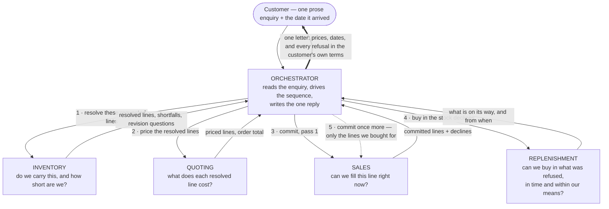

# The workflow at a glance

Five agents and the flows between them. No tools, no helpers, no tables — for
those, [`workflow-diagram-detailed.md`](workflow-diagram-detailed.md) draws the same system in
full.

One **orchestrator** owns the plan and every customer-facing word. It never
touches a system of record itself. Around it sit **four domain agents**, each
owning exactly one question and answering nothing else; none of them delegates,
so every arrow below starts or ends at the orchestrator. The sequence is fixed —
resolve, price, commit — with one bounded retry: if sales declines a line for
want of stock, the orchestrator sends replenishment to buy it in and offers the
line to sales once more. There is no third pass.

Read the numbers as the order the orchestrator drives them in. Steps 4 and 5 run
only when pass 1 declined a line for stock the customer can still be sold; the
dashed arrow is the retry, and it is the only arrow that can be skipped or
taken twice.
